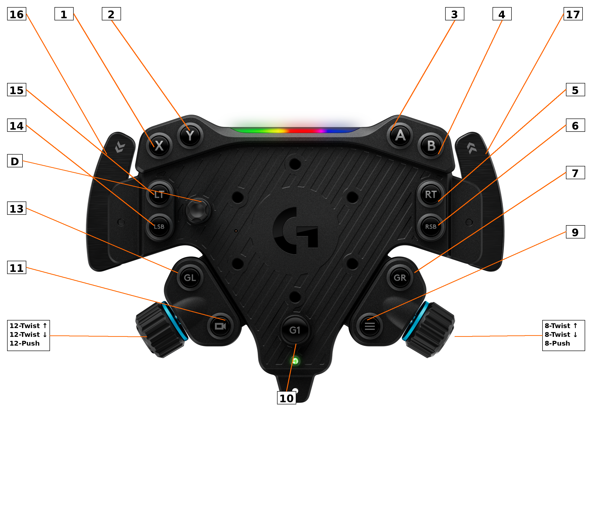

# Logitech RS50 Linux Driver

[](https://github.com/mescon/logitech-rs50-linux-driver/actions/workflows/build.yml)
[](https://www.gnu.org/licenses/old-licenses/gpl-2.0.en.html)
[](https://kernel.org/)
[](https://github.com/mescon/logitech-rs50-linux-driver/actions/workflows/build.yml)
[-orange.svg)](https://www.kernel.org/doc/html/latest/process/coding-style.html)
[](https://github.com/mescon/logitech-rs50-linux-driver/commits/master)
[](https://github.com/mescon/logitech-rs50-linux-driver/issues)
[](https://github.com/mescon/logitech-rs50-linux-driver/pulls)

> **Warning**
> This driver is under active development and may contain bugs or incomplete features. Use at your own risk. This disclaimer will be removed once the driver reaches a stable release.

Linux kernel driver for the **Logitech RS50 Direct Drive Wheel Base** (USB ID `046d:c276`).

This is a patched version of the `hid-logitech-hidpp` driver that adds RS50 support with force feedback (FF_CONSTANT) and exposes all G Hub settings via sysfs for runtime configuration.

**Note:** This driver replaces the in-kernel `hid-logitech-hidpp` module and continues to support all other Logitech HID++ devices (mice, keyboards, other racing wheels like the G29, G920, G923, etc.).

> **G Pro Racing Wheel Note:** The G Pro (046d:c272) is a direct-drive wheel like the RS50, but its FFB architecture is not yet confirmed. It may use either the standard HID++ Feature 0x8123 (like G920/G923) or dedicated endpoints (like RS50). Without USB protocol captures, we cannot add RS50-style FFB support for it.

## Features

- **Force Feedback**
  - FF_CONSTANT: Constant force effects (used by all modern racing games)
  - FF_GAIN: Master gain control

- **Complete Input Support**
  - All 17 buttons mapped
  - 8-direction D-pad
  - High-resolution wheel axis (up to 2700°)
  - 16-bit pedal axes (throttle, brake, clutch)

- **G Hub Settings via sysfs**
  - Mode switching (Desktop vs Onboard profiles)
  - Rotation range (90-2700°)
  - FFB strength, damping, TRUEFORCE
  - Sensitivity (Desktop mode) / Brake force (Onboard mode)
  - FFB filter level and auto mode
  - LIGHTSYNC LED colors, effects, direction, brightness

- **Pedal Customization**
  - Response curves (linear, low sensitivity, high sensitivity)
  - Configurable deadzones
  - Combined pedals mode for older games

## Button Mapping



The driver remaps the face buttons, triggers, and paddles to standard gamepad codes for better game compatibility.

| # | Button | Linux Input Code |
|---|--------|------------------|
| 1 | X | BTN_X |
| 2 | Y | BTN_Y |
| 3 | A | BTN_A |
| 4 | B | BTN_B |
| 5 | RT (Right Trigger) | BTN_TR |
| 6 | RSB (Right Stick Button) | BTN_THUMBR |
| 7 | GR (Gear Right) | BTN_TRIGGER_HAPPY14 |
| 8₁ | Right Encoder Twist ↑ (CW) | BTN_TRIGGER_HAPPY6 |
| 8₂ | Right Encoder Twist ↓ (CCW) | BTN_TRIGGER_HAPPY7 |
| 8₃ | Right Encoder Push | BTN_TRIGGER_HAPPY8 |
| 9 | Menu | BTN_START |
| 10 | G1 | BTN_TRIGGER_HAPPY12 |
| 11 | Camera | BTN_SELECT |
| 12₁ | Left Encoder Twist ↑ (CW) | BTN_TRIGGER_HAPPY9 |
| 12₂ | Left Encoder Twist ↓ (CCW) | BTN_TRIGGER_HAPPY10 |
| 12₃ | Left Encoder Push | BTN_TRIGGER_HAPPY11 |
| 13 | GL (Gear Left) | BTN_TRIGGER_HAPPY13 |
| 14 | LSB (Left Stick Button) | BTN_THUMBL |
| 15 | LT (Left Trigger) | BTN_TL |
| 16 | Left Paddle (behind LT) | BTN_TL2 |
| 17 | Right Paddle (behind RT) | BTN_TR2 |
| D | D-pad (right of LT/LSB) | ABS_HAT0X / ABS_HAT0Y |

## Requirements

- Linux kernel 5.15+ (tested on 5.15, 6.1, 6.8, 6.12, 6.18)
- Kernel headers for your running kernel
- Build tools: `make`, `clang` or `gcc`

## Installation

### Step 1: Build the Driver

```bash
git clone https://github.com/mescon/logitech-rs50-linux-driver.git
cd logitech-rs50-linux-driver/mainline
make
```

### Step 2: Install with DKMS (Recommended)

DKMS automatically rebuilds the driver when you update your kernel.

```bash
# Install DKMS if not already installed
# Arch: sudo pacman -S dkms
# Ubuntu/Debian: sudo apt install dkms
# Fedora: sudo dnf install dkms

# Copy source to DKMS directory
sudo mkdir -p /usr/src/hid-logitech-hidpp-1.0/build
sudo cp mainline/* /usr/src/hid-logitech-hidpp-1.0/build/
sudo cp dkms.conf /usr/src/hid-logitech-hidpp-1.0/

# Register and build with DKMS
sudo dkms add -m hid-logitech-hidpp -v 1.0
sudo dkms build -m hid-logitech-hidpp -v 1.0
sudo dkms install -m hid-logitech-hidpp -v 1.0
```

### Step 3: Blacklist the In-Kernel Driver

The kernel includes an older `hid-logitech-hidpp` driver without RS50 support. You must blacklist it:

```bash
echo "blacklist hid-logitech-hidpp" | sudo tee /etc/modprobe.d/blacklist-hid-logitech-hidpp.conf
sudo depmod -a
```

### Step 4: Load the Driver

```bash
# Unload old driver if loaded
sudo rmmod hid-logitech-hidpp 2>/dev/null

# Load new driver
sudo modprobe hid-logitech-hidpp

# Verify RS50 is detected
dmesg | grep -i "rs50"
```

You should see: `RS50: Force feedback initialized (FF_CONSTANT only)`

### Quick Test (Without DKMS)

For testing without permanent installation:

```bash
cd mainline
make
sudo rmmod hid-logitech-hidpp 2>/dev/null
sudo insmod ./hid-logitech-hidpp.ko
dmesg | grep -i rs50
```

## Usage

### Test Force Feedback

```bash
# Find your device
ls /dev/input/by-id/ | grep -i logi

# Test FFB (requires linuxconsole package)
fftest /dev/input/by-id/usb-Logitech_RS50*-event-joystick
```

### Configure Settings via sysfs

Settings are exposed at `/sys/class/hidraw/hidrawX/device/` (where X varies by system).

```bash
# Find your RS50's hidraw device
RS50_DEV=$(ls -d /sys/class/hidraw/*/device/rs50_range 2>/dev/null | head -1 | xargs dirname)
echo "RS50 found at: $RS50_DEV"

# Example: Set rotation to 900 degrees
echo 900 | sudo tee $RS50_DEV/rs50_range

# Example: Set FFB strength to 80%
echo 80 | sudo tee $RS50_DEV/rs50_strength

# Example: Set LED slot to CUSTOM 1 (slot 0)
echo 0 | sudo tee $RS50_DEV/rs50_led_slot

# Example: Set custom rainbow colors for all 10 LEDs (hex RGB triplets)
echo "ff0000 ff7f00 ffff00 00ff00 00ffff 0000ff 7f00ff ff00ff ff0080 ffffff" | sudo tee $RS50_DEV/rs50_led_colors
echo 1 | sudo tee $RS50_DEV/rs50_led_apply
```

### Available sysfs Attributes

**Mode and Profile:**

| Attribute | Range | Description |
|-----------|-------|-------------|
| `rs50_mode` | desktop/onboard | Operating mode (Desktop or Onboard profiles) |
| `rs50_profile` | 0-5 | Active profile (0=Desktop, 1-5=Onboard profiles) |

**Force Feedback:**

| Attribute | Range | Description |
|-----------|-------|-------------|
| `rs50_range` | 90-2700 | Rotation range in degrees |
| `rs50_strength` | 0-100 | FFB strength percentage |
| `rs50_damping` | 0-100 | Damping percentage |
| `rs50_trueforce` | 0-100 | TRUEFORCE audio-haptic level |
| `rs50_sensitivity` | 0-100 | Wheel sensitivity (Desktop mode only) |
| `rs50_brake_force` | 0-100 | Brake pedal load cell threshold (Onboard mode only) |
| `rs50_ffb_filter` | 0-5 | FFB smoothing level |
| `rs50_ffb_filter_auto` | 0-1 | Auto FFB filter (0=off, 1=on) |

**LIGHTSYNC LED Control:**

| Attribute | Range | Description |
|-----------|-------|-------------|
| `rs50_led_slot` | 0-4 | Active custom slot (CUSTOM 1-5) |
| `rs50_led_slot_name` | string | Slot name (max 8 chars, stored on device) |
| `rs50_led_slot_brightness` | 0-100 | Per-slot brightness (applied when slot activated) |
| `rs50_led_direction` | 0-3 | Animation direction (0=L→R, 1=R→L, 2=In→Out, 3=Out→In) |
| `rs50_led_colors` | hex | 10 space-separated RGB hex values (LED1-LED10) |
| `rs50_led_effect` | 5-9 | LED effect (5=custom/static, 6-9=built-in effects) |
| `rs50_led_brightness` | 0-100 | Global LED brightness percentage |
| `rs50_led_apply` | (write) | Apply current slot config to device |

**Pedal Configuration:**

| Attribute | Range | Description |
|-----------|-------|-------------|
| `rs50_combined_pedals` | 0-1 | Combined pedals mode |
| `rs50_throttle_curve` | 0-2 | Throttle response curve (0=linear, 1=low sens, 2=high sens) |
| `rs50_brake_curve` | 0-2 | Brake response curve |
| `rs50_clutch_curve` | 0-2 | Clutch response curve |
| `rs50_throttle_deadzone` | "L U" | Throttle deadzone (lower% upper%) |
| `rs50_brake_deadzone` | "L U" | Brake deadzone |
| `rs50_clutch_deadzone` | "L U" | Clutch deadzone |

See `docs/SYSFS_API.md` for complete API documentation with examples.

### Oversteer Compatibility

The driver exposes standard wheel attributes for [Oversteer](https://github.com/berarma/oversteer) compatibility:
- `range` - Rotation range (up to 2700°)
- `gain` - FFB strength
- `autocenter` - Autocenter strength (stub - see note below)
- `combine_pedals` - Combined pedals mode
- `damper_level` - Damping level

> **Note on autocenter:** The `autocenter` attribute is a stub that stores values locally but doesn't communicate with the device. G Hub doesn't expose an autocenter setting for the RS50, and modern direct-drive wheels don't need hardware centering - games calculate their own centering forces using FF_CONSTANT effects.

**Note:** Oversteer requires a patch for RS50 support. This patch has been submitted upstream; until merged, you can apply it manually.

The patch (`oversteer-rs50-support.patch`) adds:
- RS50 device detection (USB ID `046d:c276`)
- 2700° rotation range support
- Correct pedal axis mapping
- udev permissions for non-root access

#### Applying the Patch

**Option 1: System package / pip install**

```bash
# Find where Oversteer is installed
python3 -c "import oversteer; print(oversteer.__file__)"
# Usually: /usr/lib/python3.x/site-packages/oversteer/__init__.py

# Apply patch (adjust path as needed)
cd /usr/lib/python3.x/site-packages/
sudo patch -p1 < /path/to/oversteer-rs50-support.patch
```

**Option 2: From git source**

```bash
git clone https://github.com/berarma/oversteer.git
cd oversteer
git apply /path/to/oversteer-rs50-support.patch
sudo pip install .
```

**Option 3: Flatpak**

Flatpak apps are sandboxed, so you need to extract, patch, and reinstall:

```bash
# Export the installed Flatpak to a bundle
flatpak build-bundle ~/.local/share/flatpak/repo oversteer.flatpak \
  io.github.berarma.Oversteer

# Unfortunately, Flatpak bundles can't be easily patched.
# For Flatpak users, the recommended approach is to:
# 1. Uninstall the Flatpak version
flatpak uninstall io.github.berarma.Oversteer

# 2. Install from source with the patch applied (Option 2 above)

# 3. Or wait for the upstream patch to be merged and Flatpak updated
```

#### udev Rule (Required for non-root access)

Create `/etc/udev/rules.d/99-oversteer-rs50.rules`:

```
SUBSYSTEM=="usb", ATTRS{idVendor}=="046d", ATTRS{idProduct}=="c276", MODE="0666", TAG+="uaccess"
```

Then reload:
```bash
sudo udevadm control --reload-rules && sudo udevadm trigger
```

## Game Compatibility

The driver works with any game that supports Linux force feedback:

| Game | Status | Notes |
|------|--------|-------|
| **Native Linux** | ✓ | F1, Dirt Rally 2.0, Euro Truck Simulator 2 |
| **Proton/Steam** | ✓ | Assetto Corsa, ACC, iRacing, etc. |
| **Wine** | ✓ | Most racing games via Proton |

Games detect the wheel as a standard Linux joystick with FF support. No special configuration needed beyond setting up controls in-game.

### Proton Tips

- Enable "Steam Input" → "Gamepad with Joystick Trackpad" for some games
- Some games may need `SDL_JOYSTICK_DEVICE=/dev/input/eventX` environment variable

## Technical Details

The RS50 is a multi-interface USB device:
- **Interface 0**: Joystick input (30-byte reports) - No HID++ support
- **Interface 1**: HID++ 4.2 protocol (configuration, settings, feature discovery)
- **Interface 2**: Force feedback output (64-byte reports on endpoint 0x03)

### Architecture Difference: RS50 vs G920/G923

| Aspect | G920/G923 (Belt-driven) | RS50 (Direct-drive) |
|--------|-------------------------|---------------------|
| FFB Protocol | HID++ Feature 0x8123 | Dedicated USB endpoint |
| FFB Commands | Via HID++ FAP messages | Raw HID output reports (01 XX) |
| Interface Layout | Unified | 3 separate interfaces |
| Max Rotation | 900° | 2700° |

**Critical Implementation Detail:** The RS50 driver must initialize FFB only on Interface 1 (HID++), not Interface 0 (joystick). Interface 0 lacks HID++ support and attempting FFB initialization there causes joystick input to fail. The driver uses `HIDPP_QUIRK_RS50_FFB` to differentiate from the standard G920 code path.

See `docs/RS50_PROTOCOL_SPECIFICATION.md` for complete protocol documentation.

## Troubleshooting

### "Invalid code 768" messages during boot

These are harmless warnings from the HID descriptor declaring more buttons than physically exist. The driver patches the descriptor to prevent them during normal operation.

### FFB not working

1. Verify the driver loaded: `lsmod | grep hidpp`
2. Check dmesg for errors: `dmesg | grep -i rs50`
3. Ensure you're testing with a game/app that supports FFB

### Settings not persisting

sysfs settings are volatile and reset on driver reload. For persistent settings, add commands to a udev rule or startup script.

### Wine/Proton claiming the device (no FFB or double input)

Wine can access USB devices directly via its HID backend, bypassing the Linux driver. This causes:
- No force feedback (Wine doesn't understand the RS50 FFB protocol)
- Double/ghost inputs (both Wine and Linux see the device)
- Wheel not detected at all in some games

**Solution 1: Disable Wine's direct HID access (Recommended)**

Create a file to hide the RS50 from Wine's HID layer:

```bash
# For Steam/Proton games, add to your game's launch options:
PROTON_ENABLE_HIDRAW=0 %command%

# Or disable globally by creating:
echo 'SUBSYSTEM=="hidraw", ATTRS{idVendor}=="046d", ATTRS{idProduct}=="c276", MODE="0000"' | \
  sudo tee /etc/udev/rules.d/99-hide-rs50-from-wine.rules
sudo udevadm control --reload-rules
```

**Solution 2: Use SDL instead of Wine's dinput**

Some games work better with SDL's joystick handling:

```bash
# Steam launch options:
SDL_JOYSTICK_HIDAPI=0 %command%
```

**Solution 3: Check hidraw permissions**

If Oversteer or sysfs settings don't work, Wine may have grabbed the hidraw device:

```bash
# Find your RS50's hidraw device number
ls -la /sys/class/hidraw/*/device/rs50_range 2>/dev/null

# Check who has the device open (replace X with your hidraw number)
sudo lsof /dev/hidrawX

# If wine processes are listed, close them or use Solution 1
```

## Contributing

Contributions are welcome! This driver is forked from [JacKeTUs/hid-logitech-hidpp](https://github.com/JacKeTUs/hid-logitech-hidpp) with RS50-specific additions. If your changes apply to other Logitech devices, please consider contributing upstream as well.

## License

GPL-2.0-only (same as the Linux kernel)

## Acknowledgments

- RS50 USB protocol reverse-engineered using Wireshark captures from G Hub on Windows
- Based on [JacKeTUs/hid-logitech-hidpp](https://github.com/JacKeTUs/hid-logitech-hidpp) which adds G Pro wheel support and improved FFB
- Upstream Linux kernel [hid-logitech-hidpp driver](https://github.com/torvalds/linux/blob/master/drivers/hid/hid-logitech-hidpp.c) by Benjamin Tissoires and contributors
- [Oversteer](https://github.com/berarma/oversteer) by Bernat Arlandis for the wheel configuration GUI
